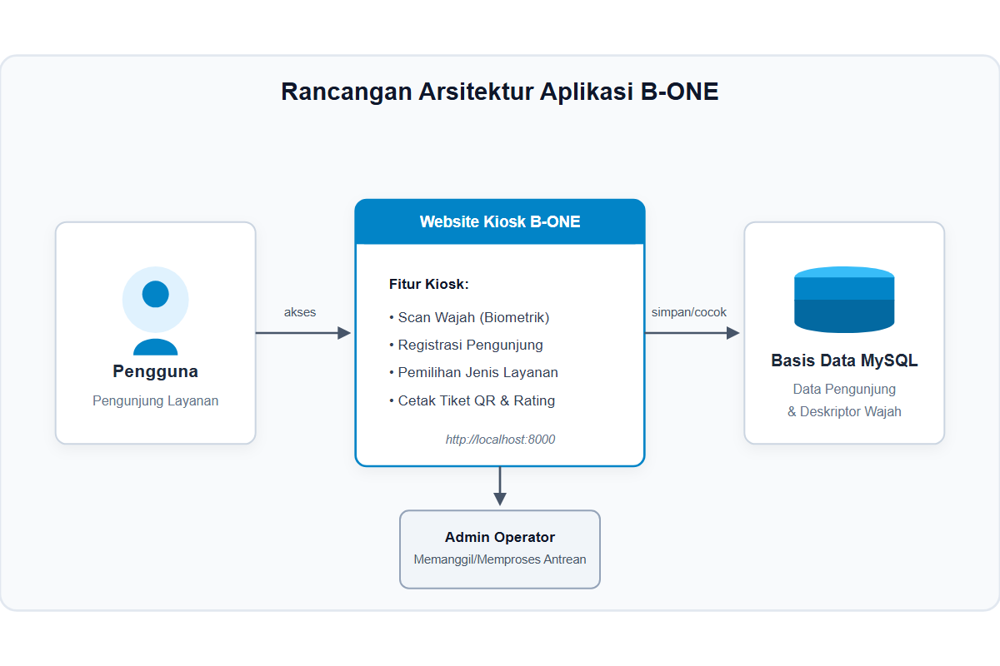
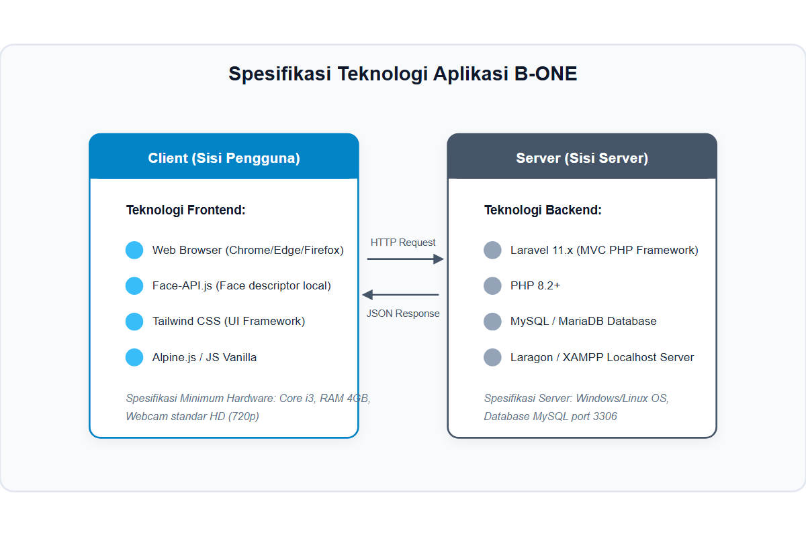
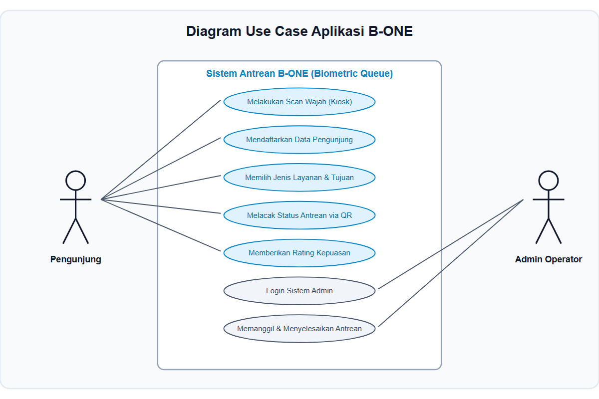
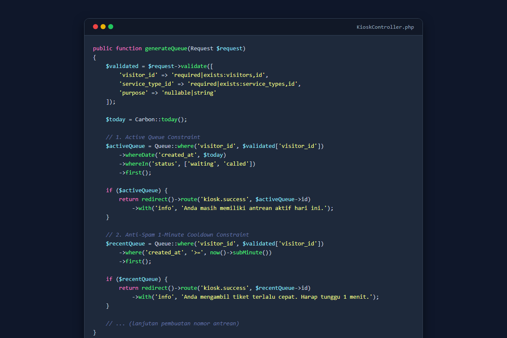
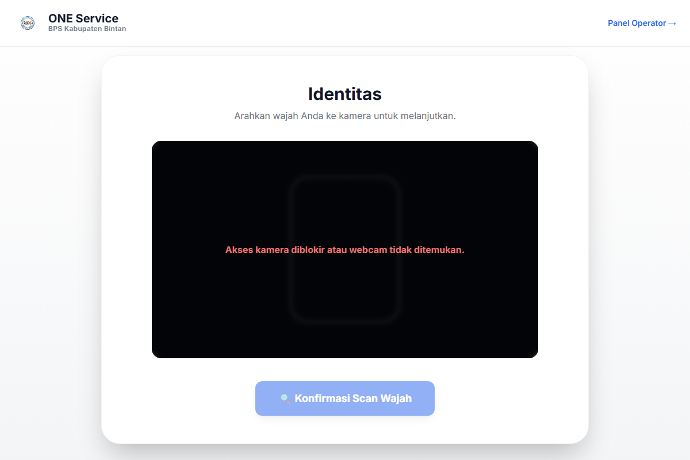
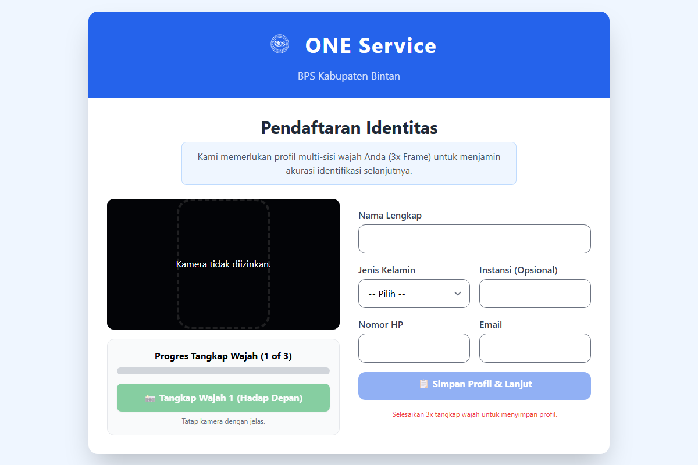
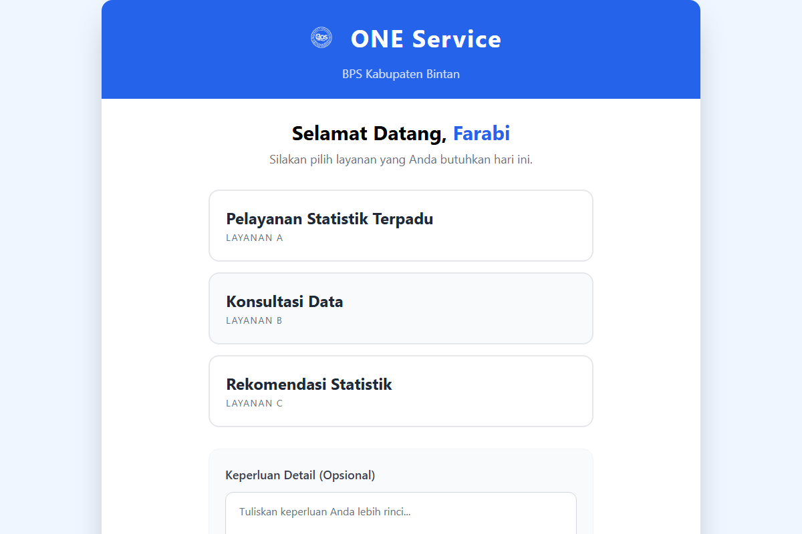
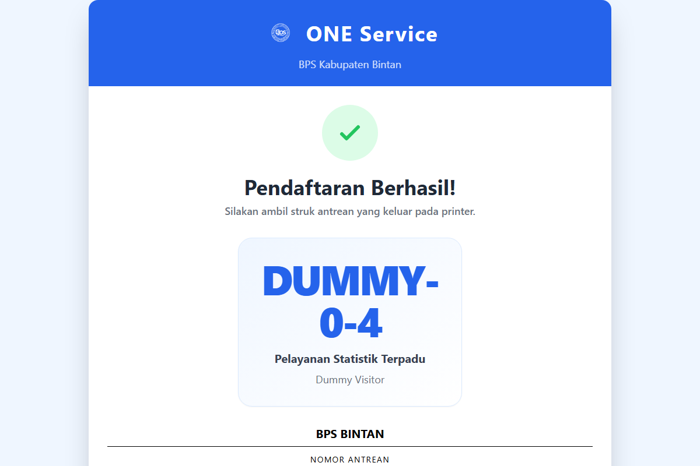
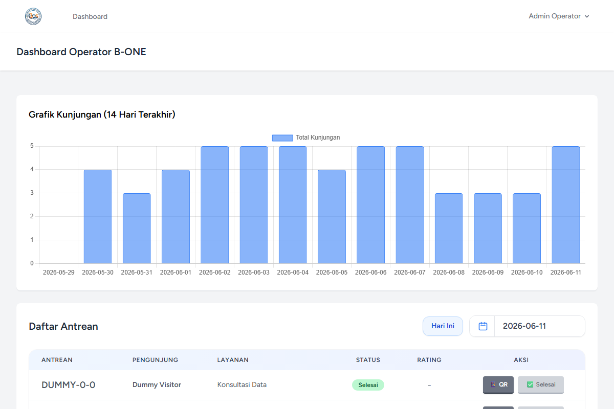

# STUDI RANCANG BANGUN/BLUEPRINT
# APLIKASI ANTRIAN BIOMETRIK B-ONE (BINTAN ONE SERVICE)

Sebagai penyedia layanan publik, Badan Pusat Statistik (BPS) Kabupaten Bintan berkomitmen untuk menyajikan pelayanan statistik terpadu yang prima, cepat, dan transparan. Pelayanan Statistik Terpadu (PST) merupakan fasilitas utama dalam berinteraksi dengan pengguna data guna memenuhi berbagai kebutuhan data sektoral dan statistik. Dalam perkembangannya, antrean manual konvensional seringkali menimbulkan inefisiensi, penumpukan pengunjung, dan kurangnya pemantauan status antrean secara real-time.

Untuk mengatasi kendala tersebut, dikembangkan **Aplikasi B-ONE (Bintan One Service)**. Aplikasi ini adalah sistem manajemen antrean berbasis web yang mengintegrasikan pencocokan biometrik pengenalan wajah (*face recognition*) di sisi client. Sistem ini dirancang untuk menyederhanakan proses registrasi, mempercepat verifikasi identitas pengunjung, mencegah penyalahgunaan tiket (*anti-spam cooldown*), menyediakan pelacakan status antrean melalui QR code, dan mengumpulkan evaluasi kepuasan layanan secara real-time. Dokumen studi rancang bangun (*blueprint*) ini disusun sebagai acuan teknis dalam pengembangan, pemeliharaan, maupun replikasi sistem.

---

## 1. Perancangan Aplikasi
Perancangan aplikasi menggambarkan alur interaksi pengguna dengan sistem B-ONE, mulai dari kedatangan pengunjung di area kiosk, proses pemindaian wajah, pengisian data jika belum terdaftar, pemilihan jenis layanan, hingga pencetakan tiket antrean yang dilengkapi kode pelacakan unik.

*Gambar 1. Rancangan Aplikasi B-ONE*

Pada **Gambar 1**, terlihat alur integrasi arsitektur sistem. Pengguna berinteraksi dengan **Website Kiosk B-ONE** secara langsung di lokasi pelayanan. Alur sistem bekerja sebagai berikut:
1. **Verifikasi Biometrik**: Kamera kiosk menangkap wajah pengguna. Library *Face-API.js* memproses deskriptor wajah di browser dan mencocokkannya dengan database pengunjung yang tersimpan secara terenkripsi di server.
2. **Registrasi Mandiri**: Jika wajah tidak dikenali, pengguna diarahkan ke formulir registrasi untuk mengisi nama, kontak, instansi, dan merekam data wajah baru.
3. **Penerbitan Tiket**: Pengguna memilih jenis layanan (Pelayanan Statistik Terpadu, Konsultasi Data, atau Rekomendasi Statistik). Sistem memvalidasi batasan antrean aktif hari ini dan batasan cooldown 1 menit sebelum menghasilkan nomor antrean unik secara atomis (misal: A-001, B-001).
4. **Pemantauan & Pemanggilan**: Pengguna mendapatkan tiket cetak berisi QR Code untuk melacak posisi antreannya via perangkat pribadi. Sementara itu, **Admin Operator** memantau dan memanggil antrean yang masuk melalui dasbor admin secara real-time.

---

## 2. Penyusunan Spesifikasi Teknologi yang Digunakan
Penyusunan spesifikasi teknologi menetapkan standar minimum perangkat lunak (*software*) dan perangkat keras (*hardware*) yang dibutuhkan agar sistem antrean biometrik B-ONE dapat beroperasi dengan optimal dan aman.

*Gambar 2. Spesifikasi Teknologi Aplikasi B-ONE*

Spesifikasi teknologi yang digunakan adalah sebagai berikut:

### A. Sisi Client (Kiosk & Operator)
1. **Perangkat Lunak (Software)**:
   - Web Browser modern dengan dukungan HTML5, CSS3, dan WebAssembly (Google Chrome versi 100+, Mozilla Firefox versi 100+, atau Microsoft Edge versi 100+).
   - Library **Face-API.js** (berbasis TensorFlow.js) untuk ekstraksi deskriptor wajah langsung pada perangkat lokal client guna mengurangi beban komputasi server.
   - **Tailwind CSS** & **Alpine.js** untuk antarmuka yang responsif dan interaktif.
2. **Perangkat Keras (Hardware)**:
   - Komputer Kiosk (Minimal Processor Intel Core i3 Gen 10 / AMD Ryzen 3, RAM 4GB, SSD 128GB).
   - Kamera Webcam HD (Resolusi minimal 720p dengan pencahayaan stabil).
   - Printer Thermal Thermal 58mm untuk cetak tiket antrean.

### B. Sisi Server & Database
1. **Perangkat Lunak (Software)**:
   - Sistem Operasi Server (Windows Server / Linux Ubuntu 20.04 LTS ke atas).
   - Bahasa Pemrograman **PHP versi 8.2** ke atas.
   - Framework **Laravel versi 11.x**.
   - Server Database **MySQL versi 8.0** atau MariaDB versi 10.4 ke atas.
   - Web Server (Nginx atau Apache, dikelola secara lokal menggunakan Laragon/XAMPP).
2. **Perangkat Keras (Hardware)**:
   - Server Lokal/Cloud (Minimal 2 vCPU, RAM 4GB, Storage SSD 40GB).

---

## 3. Diagram Use Case Aplikasi B-ONE
Diagram use case memetakan fungsionalitas sistem berdasarkan peran pengguna (*actor*) yang terlibat. Pada aplikasi B-ONE, terdapat 2 aktor utama: **Pengunjung** dan **Admin Operator**.

*Gambar 3. Diagram Use Case Aplikasi B-ONE*

### Deskripsi Peran Aktor:
1. **Pengunjung (Visitor)**:
   - **Melakukan Scan Wajah**: Mengakses kamera kiosk untuk memindai wajah.
   - **Mendaftarkan Data Pengunjung**: Mengisi formulir pendaftaran jika wajah belum dikenali oleh sistem.
   - **Memilih Jenis Layanan & Tujuan**: Menentukan layanan statistik yang diinginkan dan menuliskan tujuan kunjungan.
   - **Melacak Status Antrean**: Memindai QR code tiket untuk memantau sisa antrean secara dinamis.
   - **Memberikan Rating Kepuasan**: Memberikan penilaian (1-3 bintang) setelah layanan diselesaikan.
2. **Admin Operator**:
   - **Login Sistem Admin**: Otentikasi keamanan untuk masuk ke dasbor operator.
   - **Memanggil & Menyelesaikan Antrean**: Melakukan panggilan suara (*call*) antrean aktif dan menandai antrean yang telah selesai dilayani (*done*).
   - **Memantau Dasbor**: Melihat statistik harian, grafik tren antrean mingguan, dan daftar antrean tertunda.

---

## 4. Penulisan Kode Aplikasi Program
Penulisan kode program B-ONE menggunakan **Visual Studio Code** sebagai Integrated Development Environment (IDE). Struktur aplikasi dibangun menggunakan arsitektur MVC (Model-View-Controller) bawaan framework **Laravel**. Berikut adalah salah satu potongan kode utama yang menangani validasi antrean aktif, batas cooldown anti-spam, dan penomoran tiket secara atomik di dalam database transaksi:

*Gambar 4. Potongan Kode Validasi & Pembuatan Antrean pada KioskController.php*

Metode `generateQueue` di atas menjamin bahwa:
- Pengunjung tidak dapat mengambil tiket ganda jika masih memiliki tiket aktif hari ini (*Active Queue Constraint*).
- Mencegah spam klik tombol tiket dengan menerapkan jeda waktu tunggu minimal 1 menit (*Anti-Spam Cooldown*).
- Penomoran antrean (misal: A-001) dibuat secara berurutan dan aman dari kondisi *race condition* menggunakan fitur database locking `lockForUpdate()`.

---

## 5. Pembuatan Mobile App Aplikasi Layanan Data
*(Tahapan ini ditiadakan karena aplikasi B-ONE difokuskan penuh pada platform Web Responsive Kiosk dan Dasbor Admin Web).*

---

## 6. Implementasi Sistem
Setelah melalui tahapan perancangan dan pengodean, aplikasi B-ONE diimplementasikan pada server lokal BPS Kabupaten Bintan. Berikut adalah tangkapan layar (*screenshot*) dari laman website aplikasi yang telah berjalan:

### A. Tampilan Kiosk Scan Wajah (Halaman Depan)
Digunakan sebagai antarmuka pemindaian biometrik ketika pengunjung berdiri di depan kamera kiosk.

*Gambar 6. Halaman Depan Kiosk Pemindaian Wajah*

### B. Tampilan Formulir Registrasi Pengunjung Baru
Halaman pendaftaran mandiri bagi pengunjung baru yang data wajahnya belum terekam di sistem.

*Gambar 7. Formulir Registrasi Pengunjung Baru*

### C. Tampilan Pemilihan Jenis Layanan & Tujuan Kunjungan
Halaman yang menampilkan daftar layanan (PST, Konsultasi, Rekomendasi) setelah verifikasi wajah berhasil.

*Gambar 8. Pilihan Jenis Layanan & Tujuan Kunjungan*

### D. Halaman Tiket Antrean & Penilaian Layanan
Halaman sukses yang menampilkan struk cetakan tiket antrean, instruksi, serta tombol cetak tiket.

*Gambar 9. Tampilan Tiket Sukses & Petunjuk Cetak*

### E. Dasbor Utama Admin Operator
Halaman pemantauan bagi petugas untuk memanggil nomor antrean, memantau total kunjungan, dan melihat chart statistik harian.

*Gambar 10. Dasbor Utama Admin Operator dengan Grafik Statistik*
